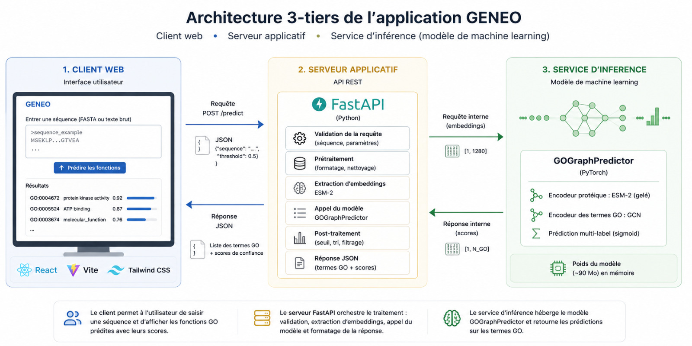
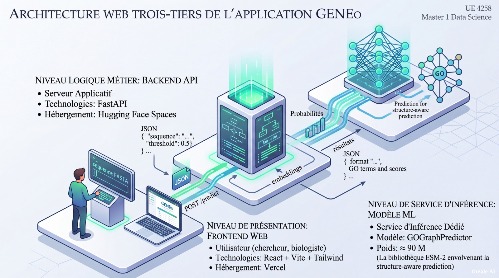

# GENEo — Deep Learning-Powered Gene Ontology Prediction Platform

[](https://geneo-front.vercel.app)
[](https://huggingface.co/spaces/sylvanod/geneo-inference)
[](LICENSE)
[](https://fastapi.tiangolo.com)
[](https://react.dev)

> **GENEo** (*Gene Ontology Prediction*) is an end-to-end, production-ready AI web platform designed for automated protein function prediction. Built upon state-of-the-art **Protein Language Models (ESM-2)** and **Graph Convolutional Networks (GCN)**, GENEo resolves large-scale hierarchical multi-label classification challenges framed by the international **CAFA 6 (Critical Assessment of Functional Annotation)** challenge.

---

## Executive Summary

Functional annotation of uncharacterized proteins remains a fundamental bottleneck in modern bioinformatics. **GENEo** bridges the gap between complex Deep Learning research and real-world biological applications by providing a lightweight, low-latency, and structure-aware inference pipeline.

### Key Performance Highlights
* **Dataset Scope:** Evaluated over **82,244 proteins** annotated with **537,027 GO terms**.
* **Target Vocabulary:** Predicts across **35,130+ Directed Acyclic Graph (DAG) terms** spanning all 3 Gene Ontology aspects:
  * **Biological Process (BP)**
  * **Molecular Function (MF)**
  * **Cellular Component (CC)**
* **Architecture Performance:** Achieves **$F_{max} = 0.4146$** on strict test sets, outperforming the non-graph baseline MLP by **+38%**.

---

## System Architecture (3-Tier Design)

GENEo is engineered as a decoupled, microservices-oriented **3-Tier Architecture**, ensuring modularity, scalable inference, and seamless deployment across cloud environments.



### 1. Presentation Tier (Frontend Web Client)
* **Framework:** React 18 + Vite + Tailwind CSS.
* **Hosting:** Vercel (`geneo-front.vercel.app`).
* **Capabilities:**
  * Interactive FASTA & raw sequence input validation.
  * Real-time threshold adjustment ($0.01 \le \text{threshold} \le 0.99$) with dynamic probability filtering.
  * Visual distribution breakdown across BP, MF, and CC namespaces.
  * One-click direct redirection to external biological databases (**QuickGO** and **AmiGO**).

### 2. Business Logic Tier (Application Server API)
* **Framework:** FastAPI (Python).
* **Hosting:** Hugging Face Spaces (`sylvanod/geneo-inference`).
* **Capabilities:**
  * Strict request validation, sequence sanitization, and REST orchestration.
  * Feature extraction dispatch and tensor normalization.
  * Post-processing, threshold filtering, and structured JSON output rendering.

### 3. Inference Service Tier (Machine Learning Core)
* **Framework:** PyTorch & PyTorch Geometric (PyG).
* **Core Model:** `GOGraphPredictor` (~90M parameters).
* **Resource Optimization:** Pre-computed static GCN GO term embeddings computed once per inference epoch, dramatically reducing GPU/RAM footprint.



---

## Machine Learning Pipeline & Innovations

```
[ Protein Sequence ]
         │
         ▼
[ ESM-2 650M Transformer ] ──► (Frozen Protein Embedding: d = 1280)
         │
         ▼
[ Normalized GO Adjacency ] ──► [ 4-Layer GCN Encoder ]
   (Sparse DAG)                      │
                                      ▼
                          [ Joint Cosine/Dot Product ]
                                      │
                                      ▼
                          [ Multi-Label Sigmoid Output ]
```

### 1. Protein Sequence Feature Extraction
We leverage **ESM-2 (`esm2_t33_650M_UR50D`)**, a 650-million parameter evolutionary scale transformer, to extract dense $1280$-dimensional representations per protein sequence without requiring alignment (MSAs).

### 2. Structure-Aware Graph Encoding (GCN)
To enforce topological consistency over the Gene Ontology Directed Acyclic Graph (DAG):
* We model parent-child relationships via a normalized sparse adjacency matrix $\tilde{A}$.
* A **4-layer Graph Convolutional Network (GCN)** maps all $N$ ontology terms into a shared latent embedding space.
* Predictions are computed through structure-aware tensor multiplication followed by element-wise Sigmoid activations.

### 3. Benchmark Progression

| Model Version | Architecture Description | Validation $F_{max}$ | Test $F_{max}$ | Key Gain |
| :--- | :--- | :---: | :---: | :--- |
| **V1 (Baseline)** | ESM-2 + Standard MLP + Linear RAG Fusion | 0.3020 | 0.3007 | Baseline reference |
| **V2 (Taxonomic)**| ESM-2 + Species Taxon Embedding + MLP | 0.3347 | 0.3335 | +11% over V1 |
| **V3 (GENEo)** | **ESM-2 + 4-Layer Hierarchical GCN** | **0.4152** | **0.4146** | **+38% over V1** |

---

## Tech Stack & Libraries

* **Frontend:** React 18, Vite, Tailwind CSS, Lucide Icons, Axios.
* **Backend:** FastAPI, Uvicorn, Pydantic, Requests.
* **Machine Learning:** PyTorch, PyTorch Geometric (PyG), Fair ESM, NumPy, SciPy, Scikit-learn.
* **DevOps & Cloud:** Vercel (Frontend CD), Hugging Face Spaces (Backend Docker/Container Services), Git.

---

## Local Setup & Installation

To run the frontend interface locally:

### Prerequisites
* Node.js (v18.0 or higher)
* npm or yarn

### Steps

1. **Clone the repository:**
   ```bash
   git clone https://github.com/sylvanodjatche/geneo-front.git
   cd geneo-front
   ```

2. **Install dependencies:**
   ```bash
   npm install
   ```

3. **Configure environment variables:**
   Create a `.env.local` file in the root directory:
   ```
   VITE_API_URL=https://sylvanod-geneo-inference.hf.space
   ```

4. **Launch the development server:**
   ```bash
   npm run dev
   ```

   Open http://localhost:5173 in your browser.

---

## Academic Context & Authors

This project was developed as part of the Master's Degree program in Data Science at the University of Yaoundé I (Academic Year 2025–2026), under the Course UE 4258.

**Authors:**
* Sylvano DJATCHE NKAMGANG (Matricule: 22W2163) 
* Idriss Chanel TAGNE TALLA (Matricule: 19M2351)

**Supervised by:** Pr. Norbert TSOPZE, Associate Professor, Department of Computer Science, University of Yaoundé I.

---

## License & Citation

This repository is distributed under the MIT License. See LICENSE for more information.

If you find this work useful in your research or applications, please cite:

```bibtex
@mastersthesis{djatche2026geneo,
  title={GENEo: Hierarchical Multi-Label Protein Function Prediction via ESM-2 Transformers and Graph Convolutional Networks},
  author={Djatche Nkamgang, Sylvano and Goujou Guimatsa, Zidane and Tagne Talla, Idriss Chanel},
  school={University of Yaounde I, Department of Computer Science},
  year={2026}
}
```
